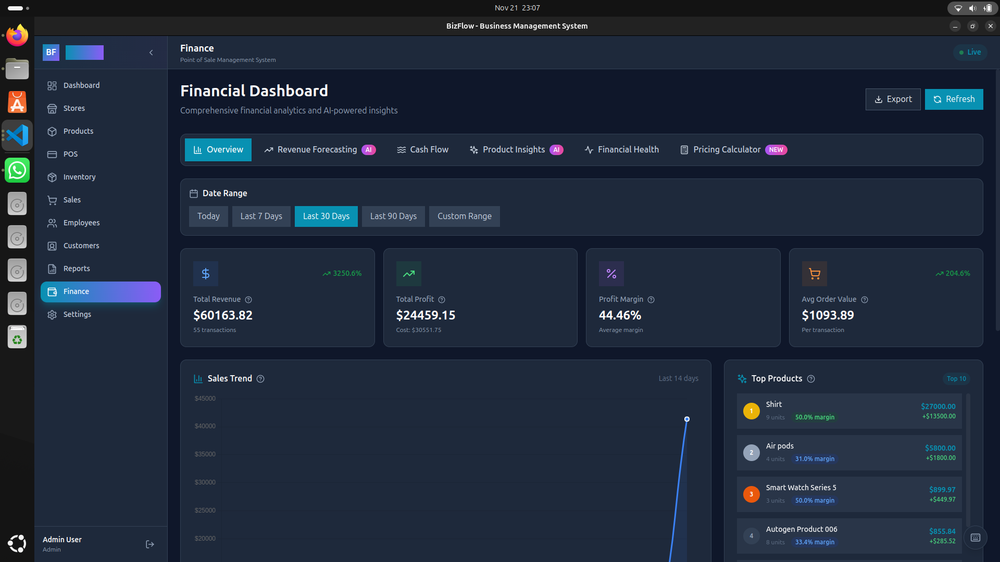
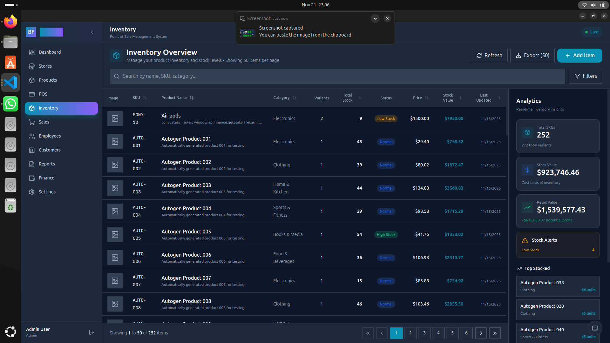
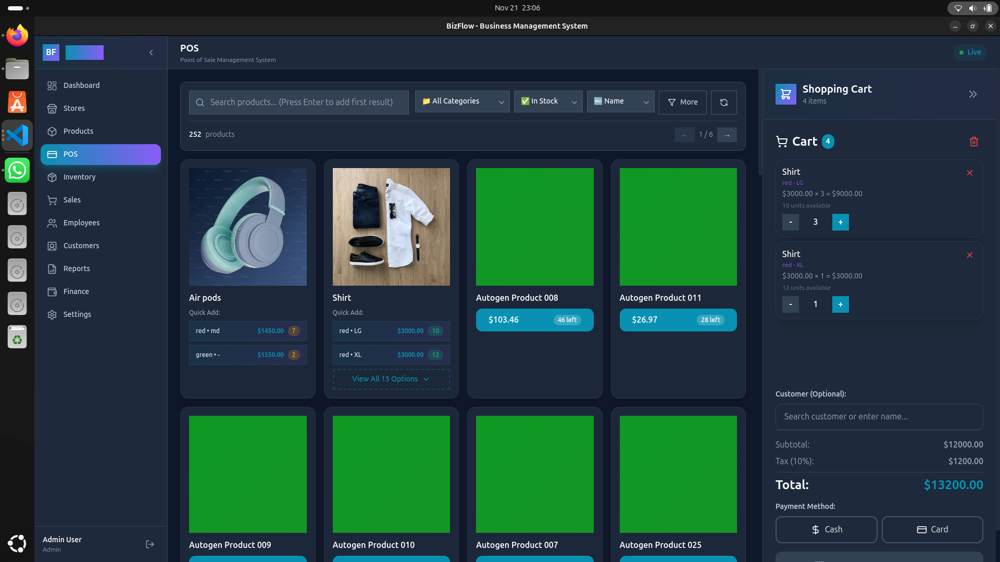
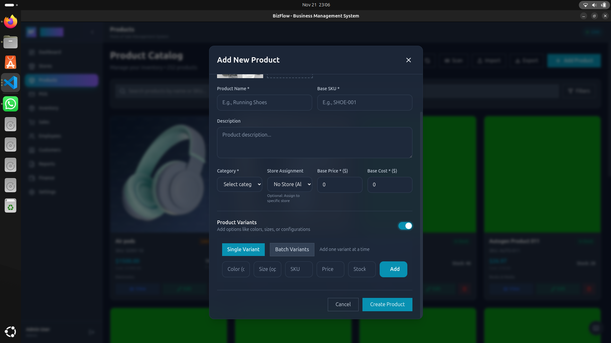
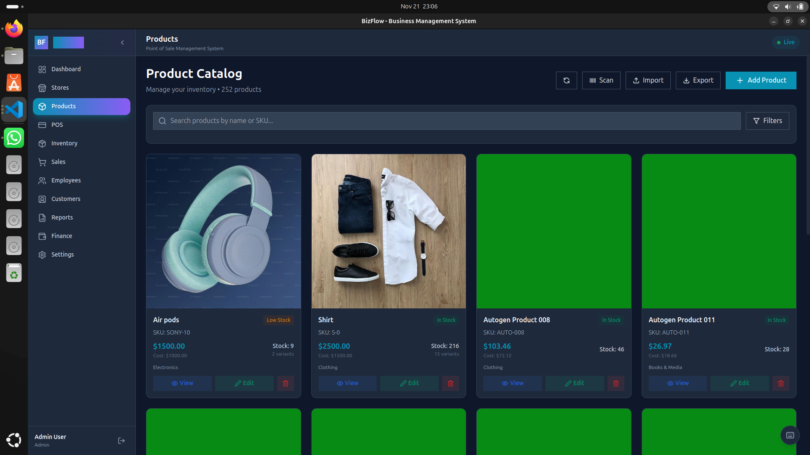
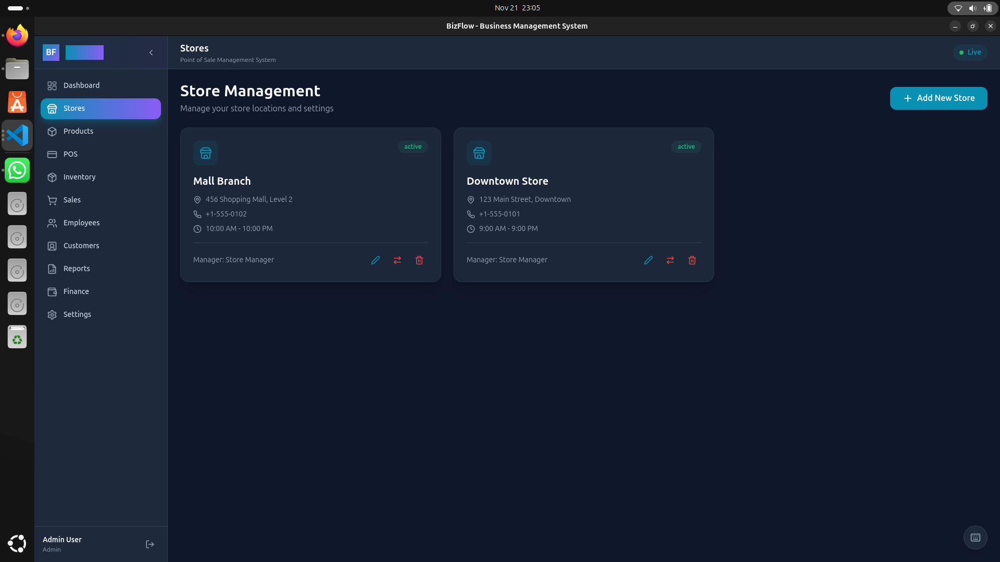
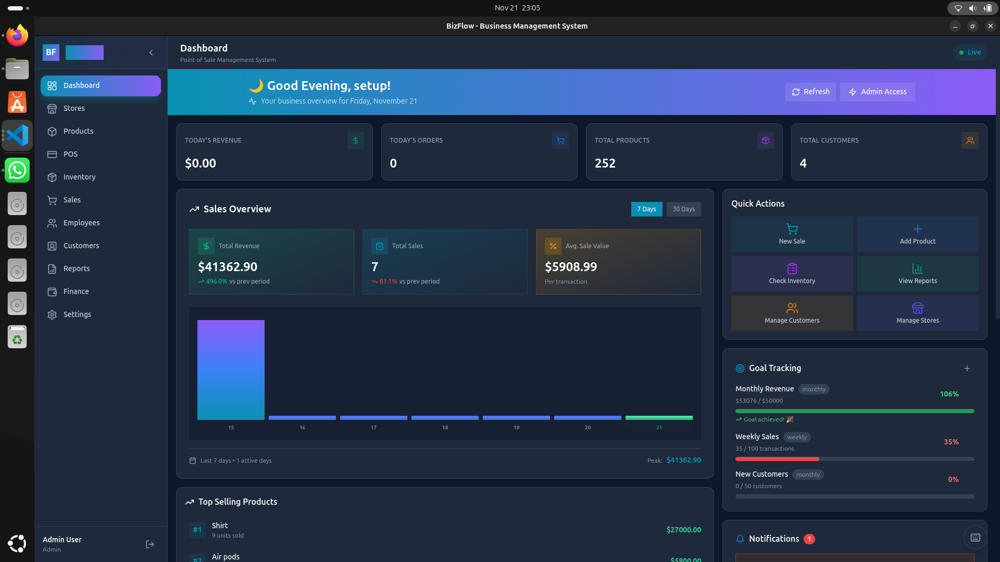
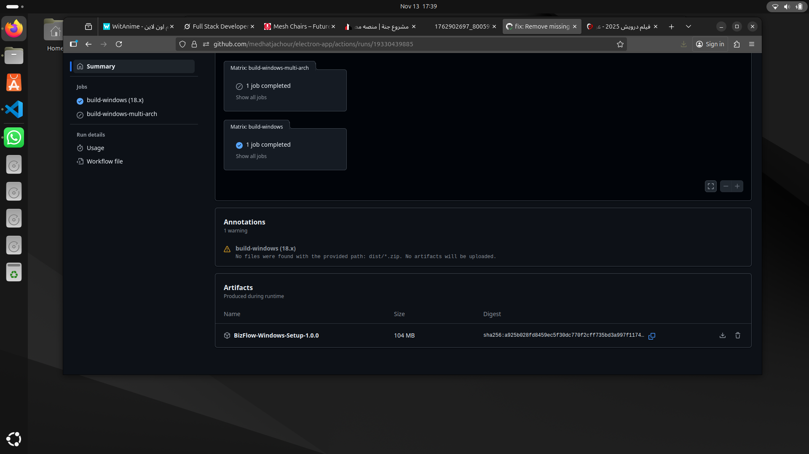
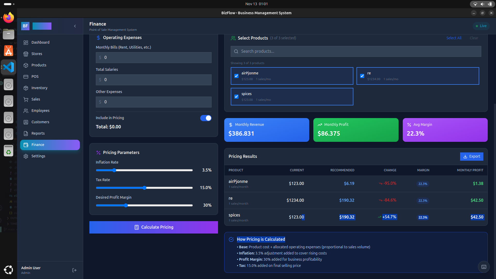
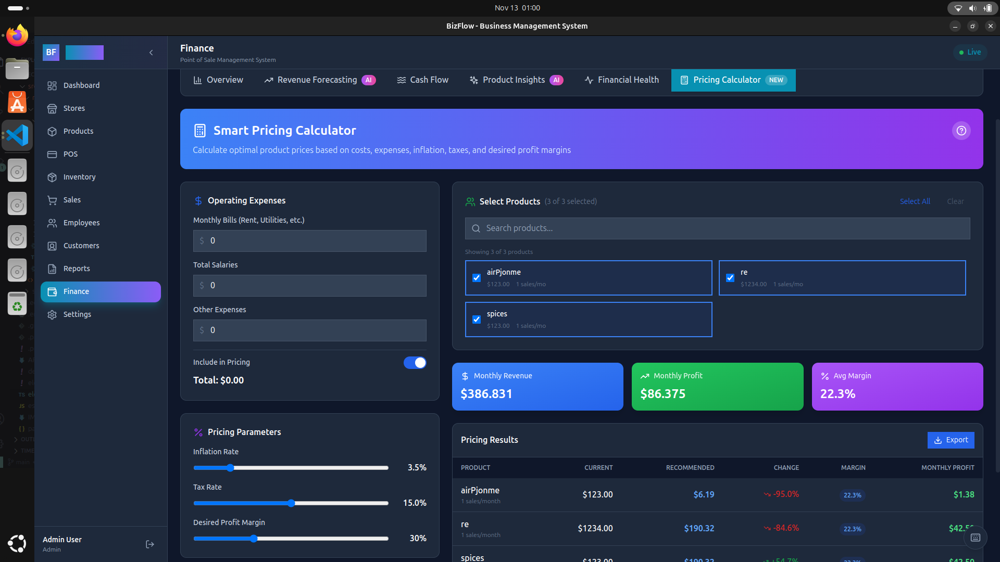

# BizFlow - Business Management System

[](https://github.com/medhatjachour/electron-app/actions/workflows/build-windows.yml)
[](LICENSE)
[](package.json)

> A modern, full-featured desktop Point of Sale and Inventory Management application built with Electron, React, and TypeScript.

**What is this?** A complete retail management solution that runs as a desktop app on Windows, macOS, and Linux. Manages sales transactions, product inventory with variants, customer data, employee records with salaries, comprehensive business reports, and provides real-time financial analytics—all stored locally with SQLite.

**Tech Stack:** Electron.js + React 18 + TypeScript + Prisma ORM + SQLite + TailwindCSS

## 📥 Download

**Windows**: [Download Latest Release](https://github.com/medhatjachour/electron-app/releases/latest) (`.exe` installer)

*macOS and Linux builds coming soon*

---

## 📸 Screenshots

<div align="center">

### 🏠 Dashboard Overview

*Real-time business metrics, revenue tracking, and quick insights*

---

### 💰 Point of Sale (POS)

*Intuitive checkout interface with product search and cart management*

---

### 📦 Product Management

*Comprehensive product catalog with variants, images, and inventory tracking*

---

### 📊 Sales Analytics

*Detailed sales reports with filtering and export capabilities*

---

### 🏪 Store Management

*Multi-store setup with location and operational details*

---

### 💸 Finance Dashboard

*Financial analytics with revenue, profit, and expense tracking*

---

### 👥 Employee Management

*Employee records with salary tracking and role management*


---

### 📈 Reports & Analytics

*Comprehensive business reports with PDF/CSV export*

---

### ⚙️ Settings & Configuration

*Theme, language, and application settings*

---

### 🔐 Login & Security

*Secure authentication with role-based access*

</div>

---

## 🏗️ Architecture

This application follows professional software engineering practices with:

- **Modular Design** - Feature-based folder structure
- **Custom Hooks Pattern** - Business logic separation
- **Component Composition** - Small, focused components
- **Type Safety** - Comprehensive TypeScript coverage
- **IPC Handler Registry** - Domain-specific backend handlers
- **Lazy Loading** - Optimized code splitting

See [ARCHITECTURE.md](./ARCHITECTURE.md) for detailed documentation.

## 📁 Project Structure

```
electron-app/
│
├── src/
│   ├── main/                          # Electron Main Process (Node.js)
│   │   ├── index.ts                   # Application entry point, window management
│   │   ├── database/
│   │   │   ├── init.ts                # Database initialization and migration
│   │   │   ├── optimization.ts        # Performance optimization (indexes, pragma)
│   │   │   └── seed-production.ts     # Production data seeding
│   │   ├── ipc/
│   │   │   ├── handlers.ts            # Central IPC handler registry
│   │   │   └── handlers/              # Domain-specific IPC handlers
│   │   │       ├── auth.handlers.ts   # Authentication & user management
│   │   │       ├── product.handlers.ts # Product CRUD operations
│   │   │       ├── sale.handlers.ts   # Sales transactions & POS
│   │   │       ├── customer.handlers.ts # Customer management
│   │   │       ├── employee.handlers.ts # Employee records & salaries
│   │   │       ├── store.handlers.ts  # Store management
│   │   │       ├── finance.handlers.ts # Financial transactions & analytics
│   │   │       ├── report.handlers.ts # Report generation (PDF/CSV)
│   │   │       ├── dashboard.handlers.ts # Dashboard metrics
│   │   │       └── settings.handlers.ts # Application settings
│   │   ├── repositories/              # Data access layer (Repository pattern)
│   │   │   └── ProductRepository.ts
│   │   ├── services/                  # Business logic layer
│   │   │   ├── CacheService.ts        # In-memory caching
│   │   │   ├── InventoryService.ts    # Stock management
│   │   │   ├── PredictionService.ts   # AI-powered predictions
│   │   │   └── ProductService.ts      # Product business logic
│   │   └── middleware/
│   │       └── authz.ts               # Authorization middleware
│   │
│   ├── preload/                       # Preload Scripts (Bridge)
│   │   ├── index.ts                   # IPC API exposure to renderer
│   │   └── index.d.ts                 # TypeScript definitions
│   │
│   ├── renderer/                      # React Application (Frontend)
│   │   ├── index.html                 # HTML entry point
│   │   └── src/
│   │       ├── App.tsx                # Main app with HashRouter & lazy loading
│   │       ├── main.tsx               # React DOM entry point
│   │       │
│   │       ├── pages/                 # Feature modules (Page-level components)
│   │       │   ├── Dashboard.tsx      # Business overview & metrics
│   │       │   ├── Login.tsx          # Authentication page
│   │       │   │
│   │       │   ├── Finance/           # Financial management module
│   │       │   │   ├── index.tsx      # Main finance page
│   │       │   │   ├── components/    # Finance-specific components
│   │       │   │   ├── hooks/         # useFinance custom hook
│   │       │   │   └── types.ts       # Finance type definitions
│   │       │   │
│   │       │   ├── Products/          # Product & inventory module
│   │       │   │   ├── index.tsx      # Product listing page
│   │       │   │   ├── ProductForm.tsx # Add/edit product form
│   │       │   │   ├── ProductCard.tsx # Product display card
│   │       │   │   ├── hooks/         # useProducts, useProductForm
│   │       │   │   └── types.ts
│   │       │   │
│   │       │   ├── POS/               # Point of Sale module
│   │       │   │   ├── index.tsx      # POS checkout interface
│   │       │   │   ├── components/    # Cart, ProductSearch, etc.
│   │       │   │   ├── hooks/         # usePOS, useCart
│   │       │   │   └── types.ts
│   │       │   │
│   │       │   ├── Sales.tsx          # Sales history & analytics
│   │       │   ├── Stores.tsx         # Multi-store management
│   │       │   ├── Employees.tsx      # Employee records & salaries
│   │       │   ├── Customers.tsx      # Customer database & loyalty
│   │       │   ├── Reports.tsx        # Business reports & exports
│   │       │   ├── Inventory.tsx      # Stock level management
│   │       │   │
│   │       │   └── Settings/          # Application settings module
│   │       │       ├── index.tsx      # Settings container
│   │       │       ├── ThemeSettings.tsx
│   │       │       ├── LanguageSettings.tsx
│   │       │       ├── StoreSettings.tsx
│   │       │       └── hooks/
│   │       │
│   │       ├── components/            # Shared/Reusable components
│   │       │   ├── layout/            # Layout components
│   │       │   │   ├── RootLayout.tsx # Main app layout wrapper
│   │       │   │   ├── Sidebar.tsx    # Navigation sidebar
│   │       │   │   └── Header.tsx     # Top header bar
│   │       │   │
│   │       │   └── ui/                # UI components (shadcn-inspired)
│   │       │       ├── Button.tsx
│   │       │       ├── Input.tsx
│   │       │       ├── Modal.tsx
│   │       │       ├── Card.tsx
│   │       │       ├── Table.tsx
│   │       │       ├── Toast.tsx
│   │       │       └── CommandPalette.tsx
│   │       │
│   │       ├── contexts/              # React Context providers
│   │       │   ├── AuthContext.tsx    # Authentication state
│   │       │   ├── ThemeContext.tsx   # Theme management
│   │       │   ├── LanguageContext.tsx # i18n localization
│   │       │   ├── ToastContext.tsx   # Toast notifications
│   │       │   └── DisplaySettingsContext.tsx
│   │       │
│   │       ├── hooks/                 # Custom React hooks
│   │       │   ├── useAuth.tsx        # Authentication hook
│   │       │   ├── useTheme.tsx       # Theme hook
│   │       │   ├── useLanguage.tsx    # Language hook
│   │       │   └── useToast.tsx       # Toast notifications hook
│   │       │
│   │       ├── services/              # Frontend service layer
│   │       │   └── api.ts             # IPC API wrapper
│   │       │
│   │       ├── utils/                 # Utility functions
│   │       │   ├── formatters.ts      # Date, currency formatters
│   │       │   ├── validators.ts      # Form validation
│   │       │   └── constants.ts       # App-wide constants
│   │       │
│   │       ├── i18n/                  # Internationalization
│   │       │   ├── en.json           # English translations
│   │       │   └── ar.json           # Arabic translations
│   │       │
│   │       └── assets/               # Static assets
│   │           ├── images/
│   │           └── fonts/
│   │
│   └── shared/                       # Shared code (Main ↔ Renderer)
│       ├── types.ts                  # Common type definitions
│       ├── types/
│       │   ├── index.ts
│       │   ├── product.types.ts
│       │   ├── sale.types.ts
│       │   └── user.types.ts
│       ├── dtos/                     # Data Transfer Objects
│       │   └── product.dto.ts
│       ├── mappers/                  # Entity ↔ DTO mappers
│       │   └── ProductMapper.ts
│       ├── factories/                # Factory pattern implementations
│       │   └── ProductFactory.ts
│       ├── interfaces/               # Shared interfaces
│       │   ├── IRepository.ts
│       │   └── IService.ts
│       ├── events/                   # Event bus for cross-process communication
│       │   └── EventBus.ts
│       ├── validation/               # Validation schemas
│       └── utils/                    # Shared utilities
│
├── prisma/                           # Database Layer
│   ├── schema.prisma                 # Prisma schema (SQLite)
│   ├── migrations/                   # Database migrations
│   ├── template.db                   # Pre-seeded template database
│   ├── seed.ts                       # Database seeding script
│   └── seed-comprehensive.ts         # Comprehensive seed data
│
├── resources/                        # Application resources
│   ├── icon.png                      # App icon
│   └── icons/                        # Platform-specific icons
│
├── samples/                          # Documentation assets
│   └── *.png                         # Application screenshots
│
├── build/                            # Build configuration
│   └── entitlements.mac.plist        # macOS entitlements
│
├── dist/                             # Build output (generated)
│   ├── win-unpacked/                 # Windows unpacked build
│   ├── bizflow-1.0.0-setup.exe      # Windows installer
│   └── builder-effective-config.yaml
│
├── out/                              # Vite build output (generated)
│   ├── main/                         # Compiled main process
│   ├── preload/                      # Compiled preload scripts
│   └── renderer/                     # Compiled React app
│
├── .github/
│   └── workflows/
│       └── build-windows.yml         # GitHub Actions CI/CD
│
├── electron.vite.config.ts           # Electron-Vite configuration
├── electron-builder.yml              # Electron Builder configuration
├── vite.config.ts                    # Vite configuration
├── tsconfig.json                     # TypeScript configuration
├── tailwind.config.js                # TailwindCSS configuration
├── package.json                      # Dependencies & scripts
└── README.md                         # Project documentation
```

### Architecture Highlights

**🏗️ Three-Layer Architecture:**
- **Presentation Layer** (Renderer): React components, pages, UI
- **Business Logic Layer** (Main): Services, repositories, handlers
- **Data Access Layer** (Main): Prisma ORM, database operations

**🔒 Security Model:**
- Context isolation enabled
- Preload script as secure bridge
- No Node.js access in renderer
- IPC-based communication only

**📦 Design Patterns Used:**
- **Repository Pattern** - Data access abstraction
- **Factory Pattern** - Object creation
- **Mapper Pattern** - DTO ↔ Entity transformation
- **Observer Pattern** - Event bus for cross-process events
- **Custom Hooks Pattern** - Reusable business logic
- **Context Provider Pattern** - Global state management

## 🚀 Getting Started

### Prerequisites

| Requirement | Version | Purpose |
|-------------|---------|---------|
| **Node.js** | 18.19+ or 20.19+ | JavaScript runtime |
| **npm** | 9.0+ | Package manager |
| **Git** | 2.0+ | Version control |
| **Python** | 3.7+ (optional) | For native module compilation |

> **Note:** Node.js 20.19+ or 22.12+ is recommended for optimal Vite performance.

### Installation

```bash
# 1. Clone the repository
git clone https://github.com/medhatjachour/electron-app.git
cd electron-app

# 2. Install dependencies
npm install

# 3. Generate Prisma client and database binaries
npx prisma generate

# 4. Run database migrations (creates schema)
npx prisma migrate dev

# 5. Seed the database with sample data
npx prisma db seed
```

**Verification:**
```bash
# Verify installation
npm run dev
```

The application should open with a login screen. Use the default credentials below.

### Default Login Credentials

| Username | Password | Role | Description |
|----------|----------|------|-------------|
| `0000` | `0000` | Admin | Full system access, created by seeding |
| `setup` | `setup123` | Admin | Initial setup account (if custom seeding used) |

> **Security:** Change default passwords immediately in production environments.

### Development

```bash
# Start development server with hot module replacement (HMR)
npm run dev

# Start with DevTools automatically opened
npm run dev -- --inspect

# Clear cache and restart
npm run dev:clean
```

**Development URLs:**
- Frontend: `http://localhost:5173` (Vite dev server)
- DevTools: Auto-opens in detached window

**Available Scripts:**

| Command | Description |
|---------|-------------|
| `npm run dev` | Start development server with HMR |
| `npm run build` | Build for current platform |
| `npm run build:win` | Build Windows installer (.exe) |
| `npm run build:mac` | Build macOS app (.dmg) |
| `npm run build:linux` | Build Linux package (.AppImage, .deb) |
| `npm run preview` | Preview production build locally |
| `npm run lint` | Run ESLint code quality checks |
| `npm run format` | Format code with Prettier |
| `npm test` | Run test suite (when implemented) |

### Building for Production

#### Windows
```bash
npm run build:win
```
**Output:** `dist/bizflow-1.0.0-setup.exe` (NSIS installer)

**Build artifacts:**
- `dist/win-unpacked/` - Unpacked application directory
- `dist/bizflow-1.0.0-setup.exe` - Installer executable

#### macOS
```bash
npm run build:mac
```
**Output:** `dist/bizflow-1.0.0.dmg` (DMG installer)

**Requirements:**
- macOS host for code signing
- Apple Developer account (for notarization)

#### Linux
```bash
npm run build:linux
```
**Output:** Multiple formats
- `dist/bizflow-1.0.0.AppImage` - Universal Linux binary
- `dist/bizflow_1.0.0_amd64.deb` - Debian/Ubuntu package
- `dist/bizflow-1.0.0.rpm` - RedHat/Fedora package

### Environment Configuration

Create a `.env` file in the project root (optional):

```env
# Database configuration
DATABASE_URL="file:./prisma/dev.db"

# Development settings
ELECTRON_RENDERER_URL="http://localhost:5173"

# Production settings (auto-configured)
NODE_ENV="production"
```

### First-Time Setup Checklist

- [ ] Install Node.js 18+ and npm
- [ ] Clone repository and install dependencies
- [ ] Run `npx prisma generate` to create Prisma client
- [ ] Run `npx prisma migrate dev` to create database
- [ ] Run `npx prisma db seed` to populate sample data
- [ ] Start dev server with `npm run dev`
- [ ] Login with `0000` / `0000`
- [ ] Create your admin user in Settings
- [ ] Customize store information
- [ ] Import your product catalog
- [ ] Configure theme and language preferences

## 🛠️ Tech Stack

### Frontend
- **React 18** - UI library
- **TypeScript** - Type safety
- **TailwindCSS** - Styling
- **Recharts** - Charts and visualizations
- **Lucide React** - Icons

### Backend
- **Electron.js** - Desktop framework
- **Prisma ORM** - Database toolkit
- **SQLite** - Local database
- **bcryptjs** - Password hashing

### Build Tools
- **Vite** - Build tool and dev server
- **electron-vite** - Electron-specific Vite config
- **electron-builder** - App packaging

## 📊 Code Quality

### Refactoring Achievements

- **13% overall code reduction** (3,837 → 3,343 lines)
- **35 modular files** instead of 5 monolithic files
- **14 unused files removed** (cleanup)
- **Custom hooks** for business logic separation
- **Comprehensive TypeScript** coverage

### Module Breakdown

| Module | Before | After | Files | Reduction |
|--------|--------|-------|-------|-----------|
| Finance | 930 lines | 686 lines | 6 | 26% |
| Products | 895 lines | 773 lines | 6 | 14% |
| Settings | 805 lines | 634 lines | 5 | 21% |
| POS | 689 lines | ~700 lines | 8 | Modularized |
| IPC Handlers | 518 lines | ~550 lines | 10 | Split |

## 🎯 Key Features Detail

### Point of Sale (POS)
- Real-time product search with barcode scanning
- Shopping cart with stock validation
- Customer selection (search or manual entry)
- Multiple payment methods (Cash, Card)
- Transaction success feedback
- Automatic stock updates

### Product Management
- Product variants (colors, sizes)
- Multiple product images
- Inventory tracking per variant
- Category organization
- Advanced filtering (category, color, size, store)
- Bulk import/export

### Employee Management
- Employee records with salary tracking
- Role assignment (Manager, Cashier, Stock Clerk, etc.)
- Performance tracking
- Contact information management
- Active/inactive status management

### Customer Management
- Customer database with loyalty tiers (Bronze, Silver, Gold, Platinum)
- Total spending tracking
- Contact information storage
- Purchase history

### Business Reports
- **Sales Reports** - Daily breakdown, payment methods, top products
- **Inventory Reports** - Stock levels by category, low stock alerts
- **Financial Reports** - Revenue, expenses, profit analysis with daily breakdown
- **Customer Reports** - Analytics with loyalty tier distribution
- **Quick Insights Dashboard** - Real-time metrics (today's revenue, orders, low stock, new customers)
- Export to PDF and CSV formats

### Finance Dashboard
- Revenue and profit tracking
- Order analytics
- Top-selling products
- Performance radar chart
- Date range filtering
- Export reports
- Expense tracking

### Settings
- Theme customization (Light, Dark, System)
- Language selection
- Store configuration
- Currency and timezone settings
- Tax receipt settings (placeholder)
- Payment method management (placeholder)

## 🔒 Security

- **Password Hashing** - bcrypt with 10 rounds
- **Context Isolation** - Electron security best practices
- **IPC Bridge** - Secure preload script
- **No Node.js in Renderer** - Sandboxed renderer process
- **Prepared Statements** - SQL injection prevention (Prisma)
- **DevTools Disabled in Production** - Security hardening for production builds

## 🧪 Testing (Planned)

```bash
# Run unit tests
npm test

# Run with coverage
npm run test:coverage

# E2E tests
npm run test:e2e
```

## 📝 Development Guidelines

### Code Organization Principles

1. **Separation of Concerns** - Keep business logic separate from UI
2. **Type Safety** - Use TypeScript for all code
3. **Custom Hooks** - Extract reusable logic into hooks
4. **Component Composition** - Build complex UIs from simple components
5. **IPC Modularity** - Domain-specific handler files
6. **Error Handling** - Always handle errors gracefully with user feedback

### Adding a New Feature Module

#### Step 1: Create Feature Folder Structure
```bash
src/renderer/src/pages/FeatureName/
├── index.tsx              # Main page component
├── types.ts               # TypeScript type definitions
├── useFeature.ts          # Business logic custom hook
└── components/            # Feature-specific components
    ├── FeatureList.tsx
    ├── FeatureForm.tsx
    └── FeatureCard.tsx
```

#### Step 2: Implement Custom Hook
```typescript
// useFeature.ts
import { useState, useEffect } from 'react'
import type { Feature } from './types'

export const useFeature = () => {
  const [data, setData] = useState<Feature[]>([])
  const [loading, setLoading] = useState(false)
  const [error, setError] = useState<string | null>(null)

  const fetchData = async () => {
    setLoading(true)
    try {
      const result = await window.electron.ipcRenderer.invoke('feature:getAll')
      setData(result)
    } catch (err) {
      setError(err.message)
    } finally {
      setLoading(false)
    }
  }

  useEffect(() => {
    fetchData()
  }, [])

  return { data, loading, error, refetch: fetchData }
}
```

#### Step 3: Create Page Component
```typescript
// index.tsx
import React from 'react'
import { useFeature } from './useFeature'
import { FeatureList } from './components/FeatureList'

export const FeaturePage: React.FC = () => {
  const { data, loading, error, refetch } = useFeature()

  if (loading) return <LoadingSpinner />
  if (error) return <ErrorMessage message={error} />

  return (
    <div>
      <h1>Features</h1>
      <FeatureList items={data} onRefresh={refetch} />
    </div>
  )
}
```

#### Step 4: Add Route in App.tsx
```typescript
// App.tsx
const FeaturePage = lazy(() => import('./pages/FeatureName'))

// Inside Routes:
<Route path="/features" element={
  <RequireAuth>
    <RootLayoutWrapper>
      <FeaturePage />
    </RootLayoutWrapper>
  </RequireAuth>
} />
```

### Adding IPC Handlers

#### Step 1: Create Handler File
```typescript
// src/main/ipc/handlers/feature.handlers.ts
import { ipcMain } from 'electron'
import type { PrismaClient } from '@prisma/client'

export function registerFeatureHandlers(prisma: PrismaClient) {
  // Get all features
  ipcMain.handle('feature:getAll', async () => {
    try {
      return await prisma.feature.findMany({
        orderBy: { createdAt: 'desc' }
      })
    } catch (error) {
      console.error('[Feature] Get all failed:', error)
      throw error
    }
  })

  // Create feature
  ipcMain.handle('feature:create', async (_event, data) => {
    try {
      return await prisma.feature.create({ data })
    } catch (error) {
      console.error('[Feature] Create failed:', error)
      throw error
    }
  })

  // Update feature
  ipcMain.handle('feature:update', async (_event, id, data) => {
    try {
      return await prisma.feature.update({
        where: { id },
        data
      })
    } catch (error) {
      console.error('[Feature] Update failed:', error)
      throw error
    }
  })

  // Delete feature
  ipcMain.handle('feature:delete', async (_event, id) => {
    try {
      return await prisma.feature.delete({ where: { id } })
    } catch (error) {
      console.error('[Feature] Delete failed:', error)
      throw error
    }
  })

  console.log('[IPC] ✅ Feature handlers registered')
}
```

#### Step 2: Register in Central Registry
```typescript
// src/main/ipc/handlers/index.ts
import { registerFeatureHandlers } from './feature.handlers'

export function registerAllHandlers(prisma: PrismaClient) {
  // ... existing handlers
  registerFeatureHandlers(prisma)
}
```

#### Step 3: Add TypeScript Types to Preload
```typescript
// src/preload/index.d.ts
interface ElectronAPI {
  // ... existing types
  feature: {
    getAll: () => Promise<Feature[]>
    create: (data: FeatureInput) => Promise<Feature>
    update: (id: string, data: FeatureInput) => Promise<Feature>
    delete: (id: string) => Promise<void>
  }
}
```

### Database Schema Changes

#### Step 1: Update Prisma Schema
```prisma
// prisma/schema.prisma
model Feature {
  id          String   @id @default(uuid())
  name        String
  description String?
  isActive    Boolean  @default(true)
  createdAt   DateTime @default(now())
  updatedAt   DateTime @updatedAt
  
  @@index([name])
  @@index([isActive])
}
```

#### Step 2: Create Migration
```bash
npx prisma migrate dev --name add_feature_table
```

#### Step 3: Regenerate Prisma Client
```bash
npx prisma generate
```

### Component Best Practices

**✅ DO:**
- Use TypeScript for all components
- Implement error boundaries
- Add loading states
- Handle empty states
- Use semantic HTML
- Add ARIA labels for accessibility
- Memoize expensive computations with `useMemo`
- Memoize callbacks with `useCallback`

**❌ DON'T:**
- Use `any` type
- Ignore error states
- Leave console.log statements in production
- Put business logic in components
- Use inline styles (use Tailwind classes)
- Forget to clean up side effects in `useEffect`

### Testing Guidelines (When Implemented)

```typescript
// __tests__/useFeature.test.ts
import { renderHook, act } from '@testing-library/react-hooks'
import { useFeature } from '../useFeature'

describe('useFeature', () => {
  it('should fetch data on mount', async () => {
    const { result, waitForNextUpdate } = renderHook(() => useFeature())
    
    expect(result.current.loading).toBe(true)
    await waitForNextUpdate()
    expect(result.current.data).toHaveLength(5)
  })
})
```

## ✨ Recent Updates

- **Rebranded to BizFlow** - Updated all UI elements, login page, and branding
- **Employee Salary Tracking** - Added salary field to employee management
- **Comprehensive Reports System** - 5 report types with PDF/CSV export
- **Production Security** - DevTools disabled in production builds
- **Code Cleanup** - Removed unused backup files and legacy code
- **Professional UI** - Slate color scheme with dark mode support

## 🔧 Troubleshooting

### White Screen on Startup

**Problem:** Application shows a blank white screen after launching the packaged executable.

**Root Cause:** This was caused by using `BrowserRouter` from React Router, which relies on HTML5 History API and requires a web server. Electron apps use the `file://` protocol without a server, causing route matching to fail.

**Solution:** We use `HashRouter` instead, which works with URL fragments (`#/route`) that don't require server-side routing.

**Technical Details:**
```typescript
// ❌ BEFORE (Broken in Electron production builds)
import { BrowserRouter } from 'react-router-dom'
<BrowserRouter>
  <Routes>...</Routes>
</BrowserRouter>
// URL: file:///C:/path/dashboard ← Doesn't exist!

// ✅ AFTER (Works in Electron)
import { HashRouter } from 'react-router-dom'
<HashRouter>
  <Routes>...</Routes>
</HashRouter>
// URL: file:///C:/path/index.html#/dashboard ← Works!
```

Additionally, `base: './'` is configured in `electron.vite.config.ts` to ensure assets load with relative paths.

### Database Not Initializing

**Problem:** Application fails to start or shows database errors.

**Solution:**
1. Ensure `prisma/migrations/` folder is included in the build
2. Template database is automatically created on first run
3. Check logs in `%APPDATA%/BizFlow/logs/` (Windows) or `~/.config/BizFlow/logs/` (Linux/macOS)

### Prisma Binary Missing

**Problem:** Error about missing query engine binary.

**Solution:** The `schema.prisma` includes all platform binaries:
```prisma
binaryTargets = ["native", "debian-openssl-3.0.x", "windows", "darwin-arm64", "darwin"]
```

Run `npx prisma generate` before building to ensure all binaries are generated.

### Build Fails on Windows

**Problem:** electron-builder fails during packaging.

**Common Causes:**
- Insufficient disk space (builds require ~2GB temporary space)
- Antivirus blocking file operations
- Path length limitations (Windows MAX_PATH)

**Solutions:**
- Disable antivirus temporarily during build
- Build in a shorter directory path (e.g., `C:\dev\app`)
- Ensure at least 3GB free disk space

### Development Server Won't Start

**Problem:** `npm run dev` fails or shows port conflicts.

**Solutions:**
```bash
# Kill existing processes
npx kill-port 5173

# Clear cache and reinstall
rm -rf node_modules dist out
npm install
npm run dev
```

## 🐛 Known Issues

- Settings page has some placeholder tabs (implementation in progress)
- Performance optimization pending for very large datasets (1000+ products)
- PDF export may have font rendering issues on some systems (investigating)

## 🔮 Roadmap

- [ ] Advanced employee expense tracking with categories
- [ ] Automated payroll reports
- [ ] Multi-store inventory sync
- [ ] Role-based access control (RBAC) for multi-user support
- [ ] Backup/restore functionality
- [ ] Receipt printing integration
- [ ] Barcode label printing
- [ ] Integration with payment gateways
- [ ] Cloud sync option (optional online backup)
- [ ] Mobile companion app

## 📚 Documentation

- [ARCHITECTURE.md](./ARCHITECTURE.md) - Comprehensive architecture documentation
- [Prisma Schema](./prisma/schema.prisma) - Database schema
- [IPC Handlers](./src/main/ipc/handlers/) - Backend API documentation

## 🤝 Contributing

We welcome contributions from the community! Whether it's bug fixes, new features, documentation improvements, or translations, your help makes BizFlow better.

### How to Contribute

#### 1. Fork & Clone
```bash
# Fork the repository on GitHub, then:
git clone https://github.com/your-username/electron-app.git
cd electron-app
git remote add upstream https://github.com/medhatjachour/electron-app.git
```

#### 2. Create a Feature Branch
```bash
git checkout -b feature/amazing-feature
# or
git checkout -b fix/bug-description
# or
git checkout -b docs/documentation-update
```

**Branch Naming Convention:**
- `feature/` - New features
- `fix/` - Bug fixes
- `docs/` - Documentation updates
- `refactor/` - Code refactoring
- `test/` - Test additions/updates
- `chore/` - Maintenance tasks

#### 3. Make Your Changes

**Code Quality Checklist:**
- [ ] Follow existing code style and conventions
- [ ] Add TypeScript types for all new code
- [ ] Update relevant documentation
- [ ] Test your changes thoroughly
- [ ] Run `npm run lint` and fix any issues
- [ ] Run `npm run format` to format code
- [ ] Ensure `npm run build` completes successfully

#### 4. Commit Your Changes
```bash
git add .
git commit -m "feat: Add amazing feature

- Detailed description of what changed
- Why the change was needed
- Any breaking changes or migration notes"
```

**Commit Message Convention:**
- `feat:` - New feature
- `fix:` - Bug fix
- `docs:` - Documentation changes
- `style:` - Code style changes (formatting, etc.)
- `refactor:` - Code refactoring
- `test:` - Test additions/updates
- `chore:` - Maintenance tasks

#### 5. Push to Your Fork
```bash
git push origin feature/amazing-feature
```

#### 6. Open a Pull Request

1. Go to the original repository on GitHub
2. Click "New Pull Request"
3. Select your feature branch
4. Fill in the PR template:
   - **Title:** Clear, concise description
   - **Description:** What changed and why
   - **Testing:** How you tested the changes
   - **Screenshots:** If UI changes are involved
   - **Related Issues:** Link any related issues

### Pull Request Guidelines

**Before Submitting:**
- ✅ Code follows project style guidelines
- ✅ All tests pass (when test suite is implemented)
- ✅ No console errors or warnings
- ✅ Documentation is updated
- ✅ Commit messages are clear and descriptive

**PR Review Process:**
1. **Automated Checks:** GitHub Actions will run builds and tests
2. **Code Review:** Maintainers will review your code
3. **Feedback:** Address any requested changes
4. **Approval:** Once approved, your PR will be merged

### Development Setup for Contributors

```bash
# Install dependencies
npm install

# Set up pre-commit hooks (optional)
npm install -D husky lint-staged
npx husky install

# Run development server
npm run dev

# Run linting
npm run lint

# Run type checking
npx tsc --noEmit
```

### Areas for Contribution

**🐛 Bug Fixes:**
- Check the [Issues](https://github.com/medhatjachour/electron-app/issues) page for reported bugs
- Reproduce the bug
- Fix and submit PR with test case

**✨ New Features:**
- Discuss feature ideas in [Discussions](https://github.com/medhatjachour/electron-app/discussions)
- Get approval before starting large features
- Follow the architecture patterns in the codebase

**📚 Documentation:**
- Improve README
- Add code comments
- Create tutorials or guides
- Fix typos or unclear explanations

**🌍 Translations:**
- Add new language translations in `src/renderer/src/i18n/`
- Update existing translations
- Test RTL support for Arabic and similar languages

**🧪 Testing:**
- Add unit tests for components
- Add integration tests for features
- Improve test coverage

**🎨 UI/UX Improvements:**
- Enhance user interface
- Improve accessibility
- Add animations or visual polish
- Fix responsive design issues

### Code Style Guidelines

**TypeScript:**
```typescript
// ✅ Good
interface User {
  id: string
  name: string
  email: string
}

const fetchUsers = async (): Promise<User[]> => {
  const users = await window.electron.ipcRenderer.invoke('user:getAll')
  return users
}

// ❌ Avoid
const fetchUsers = async () => {
  const users: any = await window.electron.ipcRenderer.invoke('user:getAll')
  return users
}
```

**React Components:**
```typescript
// ✅ Good
export const UserCard: React.FC<{ user: User }> = ({ user }) => {
  return (
    <div className="rounded-lg border p-4">
      <h3 className="text-lg font-semibold">{user.name}</h3>
      <p className="text-sm text-gray-600">{user.email}</p>
    </div>
  )
}

// ❌ Avoid
export const UserCard = (props) => {
  return (
    <div style={{ borderRadius: '8px', border: '1px solid', padding: '16px' }}>
      <h3>{props.user.name}</h3>
    </div>
  )
}
```

### Getting Help

- **Questions:** Open a [Discussion](https://github.com/medhatjachour/electron-app/discussions)
- **Bug Reports:** Open an [Issue](https://github.com/medhatjachour/electron-app/issues)
- **Feature Requests:** Open a [Discussion](https://github.com/medhatjachour/electron-app/discussions) first

### Code of Conduct

- Be respectful and inclusive
- Provide constructive feedback
- Focus on the issue, not the person
- Help others learn and grow

Thank you for contributing to BizFlow! 🎉

## 📄 License

This project is licensed under the MIT License - see the [LICENSE](LICENSE) file for details.

## 🛠️ Technical Stack Details

### Core Technologies

| Technology | Version | Purpose | Why Chosen |
|------------|---------|---------|------------|
| **Electron** | 26.6.10 | Desktop framework | Cross-platform, native capabilities, large ecosystem |
| **React** | 18.2.0 | UI library | Component-based, virtual DOM, excellent DX |
| **TypeScript** | 5.3.3 | Type safety | Catch errors early, better IDE support, self-documenting |
| **Prisma** | 5.22.0 | ORM | Type-safe queries, migrations, excellent DX |
| **SQLite** | 3.x | Database | Embedded, zero-config, perfect for desktop apps |
| **Vite** | 5.4.11 | Build tool | Fast HMR, optimized builds, modern tooling |

### UI & Styling

| Library | Purpose |
|---------|---------|
| **TailwindCSS** | Utility-first CSS framework |
| **Lucide React** | 1000+ consistent icons |
| **Recharts** | Data visualization and charts |
| **Framer Motion** | Smooth animations (planned) |

### State Management

| Tool | Purpose |
|------|---------|
| **React Context** | Global state (Auth, Theme, Language) |
| **Custom Hooks** | Business logic encapsulation |
| **Local State** | Component-specific state |

### Security

| Feature | Implementation |
|---------|----------------|
| **Password Hashing** | bcryptjs with 10 rounds |
| **Context Isolation** | Enabled by default |
| **Sandboxing** | Renderer process sandboxed |
| **CSP** | Content Security Policy (planned) |
| **SQL Injection** | Prevented via Prisma prepared statements |

### Performance Optimizations

- **Code Splitting** - Lazy loading for routes
- **React.memo** - Prevent unnecessary re-renders
- **useMemo/useCallback** - Memoization of expensive operations
- **Virtualization** - For large lists (planned)
- **Database Indexes** - Optimized query performance
- **PRAGMA Optimization** - SQLite performance tuning

### Build & Deployment

| Tool | Purpose |
|------|---------|
| **electron-builder** | App packaging & distribution |
| **GitHub Actions** | CI/CD automation |
| **NSIS** | Windows installer creation |
| **DMG** | macOS installer (planned) |
| **AppImage/Deb** | Linux distribution (planned) |

##  Acknowledgments

We stand on the shoulders of giants. This project wouldn't be possible without:

### Core Technologies
- **[Electron.js](https://www.electronjs.org/)** - For enabling desktop apps with web technologies
- **[React Team](https://react.dev/)** - For the best UI library and ecosystem
- **[TypeScript Team](https://www.typescriptlang.org/)** - For making JavaScript scalable and maintainable
- **[Prisma](https://www.prisma.io/)** - For the best TypeScript ORM experience

### UI & Tooling
- **[TailwindCSS](https://tailwindcss.com/)** - For beautiful, maintainable styling
- **[Lucide](https://lucide.dev/)** - For the comprehensive icon library
- **[Recharts](https://recharts.org/)** - For elegant data visualizations
- **[Vite](https://vitejs.dev/)** - For blazing fast build tooling

### Community
- **Open Source Contributors** - For all the amazing libraries we use
- **GitHub** - For hosting, CI/CD, and collaboration tools
- **Stack Overflow Community** - For countless solutions and insights
- **You!** - For using, testing, and contributing to BizFlow

### Special Thanks
- Everyone who reported bugs, suggested features, or contributed code
- Beta testers who helped identify edge cases
- Documentation readers who pointed out unclear sections

---

## 📞 Support & Contact

**Issues & Bug Reports:** [GitHub Issues](https://github.com/medhatjachour/electron-app/issues)

**Feature Requests:** [GitHub Discussions](https://github.com/medhatjachour/electron-app/discussions)

**Security Issues:** Please email security concerns privately to [your-email@example.com]

**General Questions:** Open a [Discussion](https://github.com/medhatjachour/electron-app/discussions)

---

## 📊 Project Stats


---

<div align="center">

**Built with ❤️ using Electron + React + TypeScript**

### BizFlow - Streamline your business operations with confidence

[](https://github.com/medhatjachour/electron-app/releases/latest)
[](https://github.com/medhatjachour/electron-app)

*Professional business management, simplified.*

</div>

---

## 💻 Recommended IDE Setup

### Visual Studio Code (Recommended)

**Essential Extensions:**
- [ESLint](https://marketplace.visualstudio.com/items?itemName=dbaeumer.vscode-eslint) - Code quality and linting
- [Prettier](https://marketplace.visualstudio.com/items?itemName=esbenp.prettier-vscode) - Code formatting
- [TypeScript Vue Plugin (Volar)](https://marketplace.visualstudio.com/items?itemName=Vue.vscode-typescript-vue-plugin) - TypeScript support
- [Tailwind CSS IntelliSense](https://marketplace.visualstudio.com/items?itemName=bradlc.vscode-tailwindcss) - Tailwind autocomplete
- [Prisma](https://marketplace.visualstudio.com/items?itemName=Prisma.prisma) - Prisma schema support

**Recommended Settings (.vscode/settings.json):**
```json
{
  "editor.formatOnSave": true,
  "editor.defaultFormatter": "esbenp.prettier-vscode",
  "editor.codeActionsOnSave": {
    "source.fixAll.eslint": true
  },
  "typescript.tsdk": "node_modules/typescript/lib",
  "tailwindCSS.experimental.classRegex": [
    ["clsx\\(([^)]*)\\)", "(?:'|\"|`)([^']*)(?:'|\"|`)"]
  ]
}
```

### Alternative IDEs

**WebStorm:**
- Built-in TypeScript and React support
- Excellent refactoring tools
- Premium IDE ($)

**Cursor:**
- AI-powered code editor
- Built on VSCode
- Great for AI-assisted development

---

## 📜 License

This project is licensed under the **MIT License** - see the [LICENSE](LICENSE) file for details.

**What this means:**
- ✅ Commercial use allowed
- ✅ Modification allowed
- ✅ Distribution allowed
- ✅ Private use allowed
- ℹ️ License and copyright notice must be included

---

<div align="center">

**Version 1.0.0** | [Changelog](CHANGELOG.md) | [Roadmap](#-roadmap)

Made with 💙 by [Medhat Jachour](https://github.com/medhatjachour)

⭐ **Star this repo if you find it useful!** ⭐

</div>
