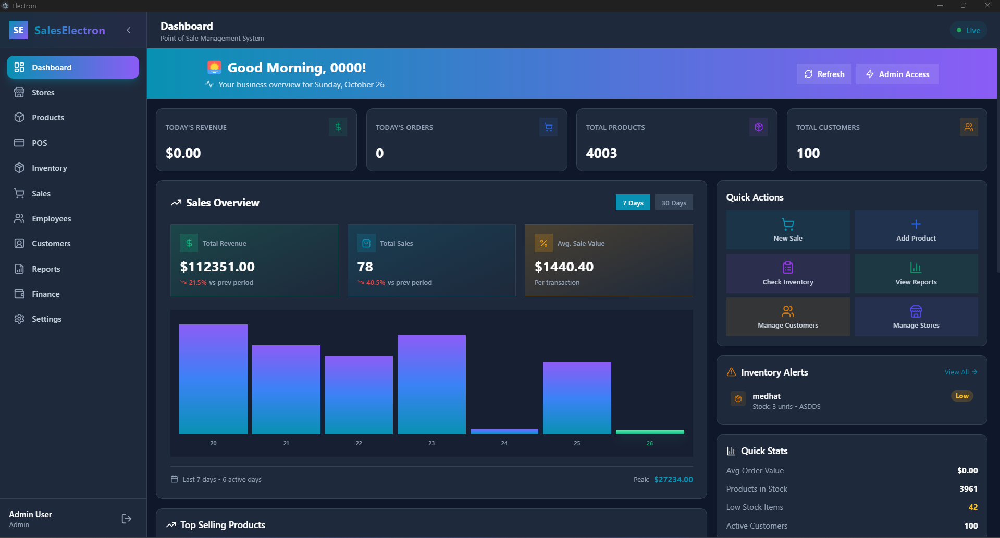
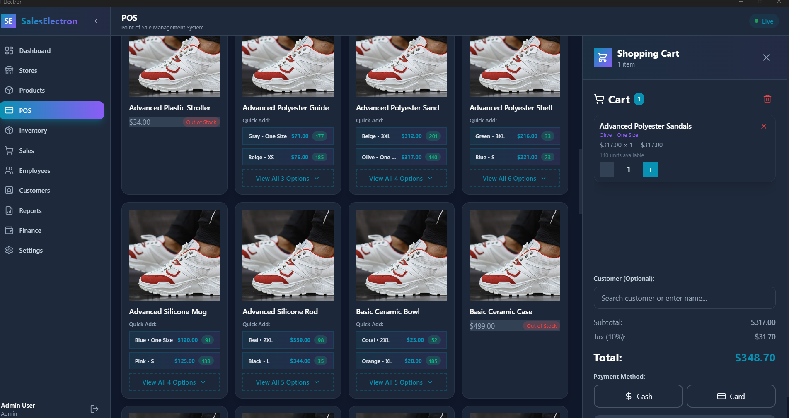
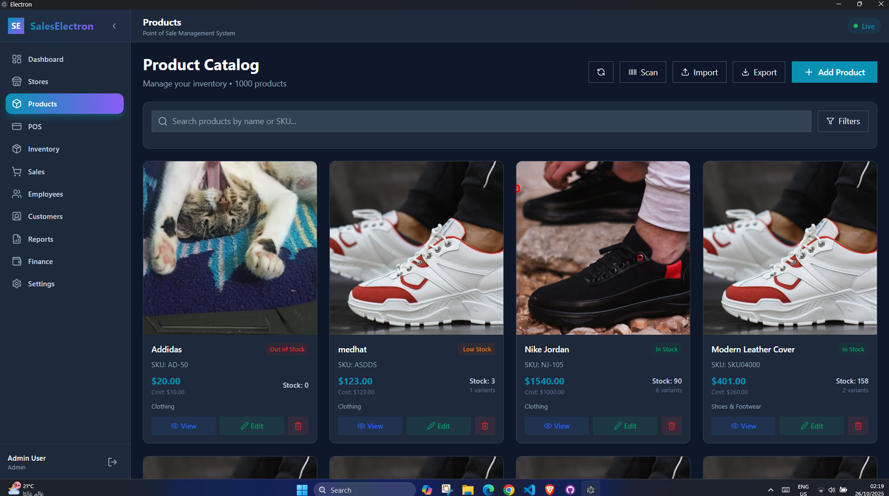

# BizFlow - Business Management System

[](https://github.com/medhatjachour/electron-app/actions/workflows/build-windows.yml)
[](LICENSE)
[](package.json)

> A modern, full-featured desktop Point of Sale and Inventory Management application built with Electron, React, and TypeScript.

**What is this?** A complete retail management solution that runs as a desktop app on Windows, macOS, and Linux. Manages sales transactions, product inventory with variants, customer data, employee records with salaries, comprehensive business reports, and provides real-time financial analytics—all stored locally with SQLite.

**Tech Stack:** Electron.js + React 18 + TypeScript + Prisma ORM + SQLite + TailwindCSS

## 📥 Download

**Windows**: [Download Latest Release](https://github.com/medhatjachour/electron-app/releases/latest) (`.exe` installer)

*macOS and Linux builds coming soon*

---

## 📸 Screenshots

### Dashboard


### Point of Sale (POS)


### Product Management


### Sales Analytics


### Store Management


### Finance Dashboard


---

## 🏗️ Architecture

This application follows professional software engineering practices with:

- **Modular Design** - Feature-based folder structure
- **Custom Hooks Pattern** - Business logic separation
- **Component Composition** - Small, focused components
- **Type Safety** - Comprehensive TypeScript coverage
- **IPC Handler Registry** - Domain-specific backend handlers
- **Lazy Loading** - Optimized code splitting

See [ARCHITECTURE.md](./ARCHITECTURE.md) for detailed documentation.

## 📁 Project Structure

```
src/
├── main/                  # Electron main process
│   ├── index.ts          # Entry point
│   └── ipc/              # IPC communication
│       ├── handlers.ts   # Handler entry
│       └── handlers/     # Domain handlers (10 files)
│
├── preload/              # Preload scripts
│   └── index.ts
│
└── renderer/             # React application
    └── src/
        ├── App.tsx       # Main app with routing
        ├── contexts/     # React contexts (Auth, Theme, Language)
        ├── pages/        # Feature modules
        │   ├── Dashboard.tsx
        │   ├── Finance/      # 6 files, 686 lines
        │   ├── Products/     # 6 files, 773 lines
        │   ├── Settings/     # 5 files, 634 lines
        │   └── POS/          # 8 files, ~700 lines
        ├── components/   # Shared components
        ├── hooks/        # Custom hooks
        └── utils/        # Utilities
```

## 🚀 Getting Started

### Prerequisites

- Node.js 18+ and npm
- Git

### Installation

```bash
# Clone the repository
git clone https://github.com/yourusername/electron-app.git
cd electron-app

# Install dependencies
npm install

# Generate Prisma client
npx prisma generate

# Run database migrations
npx prisma migrate dev

# Seed the database (creates demo user: 0000/0000)
npx prisma db seed
```

### Development

```bash
# Start development server with hot reload
npm run dev
```

**Default Login Credentials:**
- Username: `setup`
- Password: `setup123`

> First-time users: Use the setup account to create your permanent admin user.

### Building

```bash
# Build for Windows
npm run build:win

# Build for macOS
npm run build:mac

# Build for Linux
npm run build:linux
```

## 🛠️ Tech Stack

### Frontend
- **React 18** - UI library
- **TypeScript** - Type safety
- **TailwindCSS** - Styling
- **Recharts** - Charts and visualizations
- **Lucide React** - Icons

### Backend
- **Electron.js** - Desktop framework
- **Prisma ORM** - Database toolkit
- **SQLite** - Local database
- **bcryptjs** - Password hashing

### Build Tools
- **Vite** - Build tool and dev server
- **electron-vite** - Electron-specific Vite config
- **electron-builder** - App packaging

## 📊 Code Quality

### Refactoring Achievements

- **13% overall code reduction** (3,837 → 3,343 lines)
- **35 modular files** instead of 5 monolithic files
- **14 unused files removed** (cleanup)
- **Custom hooks** for business logic separation
- **Comprehensive TypeScript** coverage

### Module Breakdown

| Module | Before | After | Files | Reduction |
|--------|--------|-------|-------|-----------|
| Finance | 930 lines | 686 lines | 6 | 26% |
| Products | 895 lines | 773 lines | 6 | 14% |
| Settings | 805 lines | 634 lines | 5 | 21% |
| POS | 689 lines | ~700 lines | 8 | Modularized |
| IPC Handlers | 518 lines | ~550 lines | 10 | Split |

## 🎯 Key Features Detail

### Point of Sale (POS)
- Real-time product search with barcode scanning
- Shopping cart with stock validation
- Customer selection (search or manual entry)
- Multiple payment methods (Cash, Card)
- Transaction success feedback
- Automatic stock updates

### Product Management
- Product variants (colors, sizes)
- Multiple product images
- Inventory tracking per variant
- Category organization
- Advanced filtering (category, color, size, store)
- Bulk import/export

### Employee Management
- Employee records with salary tracking
- Role assignment (Manager, Cashier, Stock Clerk, etc.)
- Performance tracking
- Contact information management
- Active/inactive status management

### Customer Management
- Customer database with loyalty tiers (Bronze, Silver, Gold, Platinum)
- Total spending tracking
- Contact information storage
- Purchase history

### Business Reports
- **Sales Reports** - Daily breakdown, payment methods, top products
- **Inventory Reports** - Stock levels by category, low stock alerts
- **Financial Reports** - Revenue, expenses, profit analysis with daily breakdown
- **Customer Reports** - Analytics with loyalty tier distribution
- **Quick Insights Dashboard** - Real-time metrics (today's revenue, orders, low stock, new customers)
- Export to PDF and CSV formats

### Finance Dashboard
- Revenue and profit tracking
- Order analytics
- Top-selling products
- Performance radar chart
- Date range filtering
- Export reports
- Expense tracking

### Settings
- Theme customization (Light, Dark, System)
- Language selection
- Store configuration
- Currency and timezone settings
- Tax receipt settings (placeholder)
- Payment method management (placeholder)

## 🔒 Security

- **Password Hashing** - bcrypt with 10 rounds
- **Context Isolation** - Electron security best practices
- **IPC Bridge** - Secure preload script
- **No Node.js in Renderer** - Sandboxed renderer process
- **Prepared Statements** - SQL injection prevention (Prisma)
- **DevTools Disabled in Production** - Security hardening for production builds

## 🧪 Testing (Planned)

```bash
# Run unit tests
npm test

# Run with coverage
npm run test:coverage

# E2E tests
npm run test:e2e
```

## 📝 Development Guidelines

### Adding a New Feature Module

1. Create folder: `src/renderer/src/pages/FeatureName/`
2. Create files:
   ```
   FeatureName/
   ├── index.tsx      # Main component
   ├── types.ts       # Type definitions
   ├── useFeature.ts  # Business logic hook
   └── Component.tsx  # Sub-components
   ```
3. Add lazy import in `App.tsx`
4. Add route in `App.tsx`

### Adding IPC Handlers

1. Create: `src/main/ipc/handlers/domain.handlers.ts`
2. Export `registerDomainHandlers(prisma)` function
3. Register in `handlers/index.ts`

## ✨ Recent Updates

- **Rebranded to BizFlow** - Updated all UI elements, login page, and branding
- **Employee Salary Tracking** - Added salary field to employee management
- **Comprehensive Reports System** - 5 report types with PDF/CSV export
- **Production Security** - DevTools disabled in production builds
- **Code Cleanup** - Removed unused backup files and legacy code
- **Professional UI** - Slate color scheme with dark mode support

## 🐛 Known Issues

- Settings page has some placeholder tabs (implementation in progress)
- Performance optimization pending for very large datasets (1000+ products)

## 🔮 Roadmap

- [ ] Advanced employee expense tracking with categories
- [ ] Automated payroll reports
- [ ] Multi-store inventory sync
- [ ] Role-based access control (RBAC) for multi-user support
- [ ] Backup/restore functionality
- [ ] Receipt printing integration
- [ ] Barcode label printing
- [ ] Integration with payment gateways
- [ ] Cloud sync option (optional online backup)
- [ ] Mobile companion app

## 📚 Documentation

- [ARCHITECTURE.md](./ARCHITECTURE.md) - Comprehensive architecture documentation
- [Prisma Schema](./prisma/schema.prisma) - Database schema
- [IPC Handlers](./src/main/ipc/handlers/) - Backend API documentation

## 🤝 Contributing

Contributions are welcome! Please follow these steps:

1. Fork the repository
2. Create a feature branch (`git checkout -b feature/amazing-feature`)
3. Commit your changes (`git commit -m 'Add amazing feature'`)
4. Push to the branch (`git push origin feature/amazing-feature`)
5. Open a Pull Request

## 📄 License

This project is licensed under the MIT License - see the [LICENSE](LICENSE) file for details.

##  Acknowledgments

- Electron.js community for the amazing framework
- React and TypeScript teams for robust tooling
- Prisma team for the best ORM experience
- TailwindCSS for beautiful, maintainable styling
- Lucide React for comprehensive icon library
- All open-source contributors who make projects like this possible

---

**Built with ❤️ using Electron + React + TypeScript**

**BizFlow** - Streamline your business operations with confidence.

## Recommended IDE Setup

- [VSCode](https://code.visualstudio.com/) + [ESLint](https://marketplace.visualstudio.com/items?itemName=dbaeumer.vscode-eslint) + [Prettier](https://marketplace.visualstudio.com/items?itemName=esbenp.prettier-vscode)
